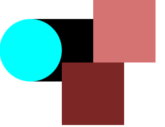
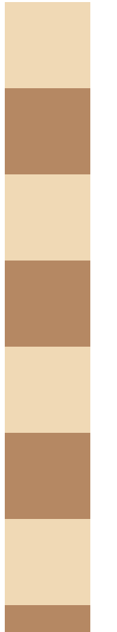
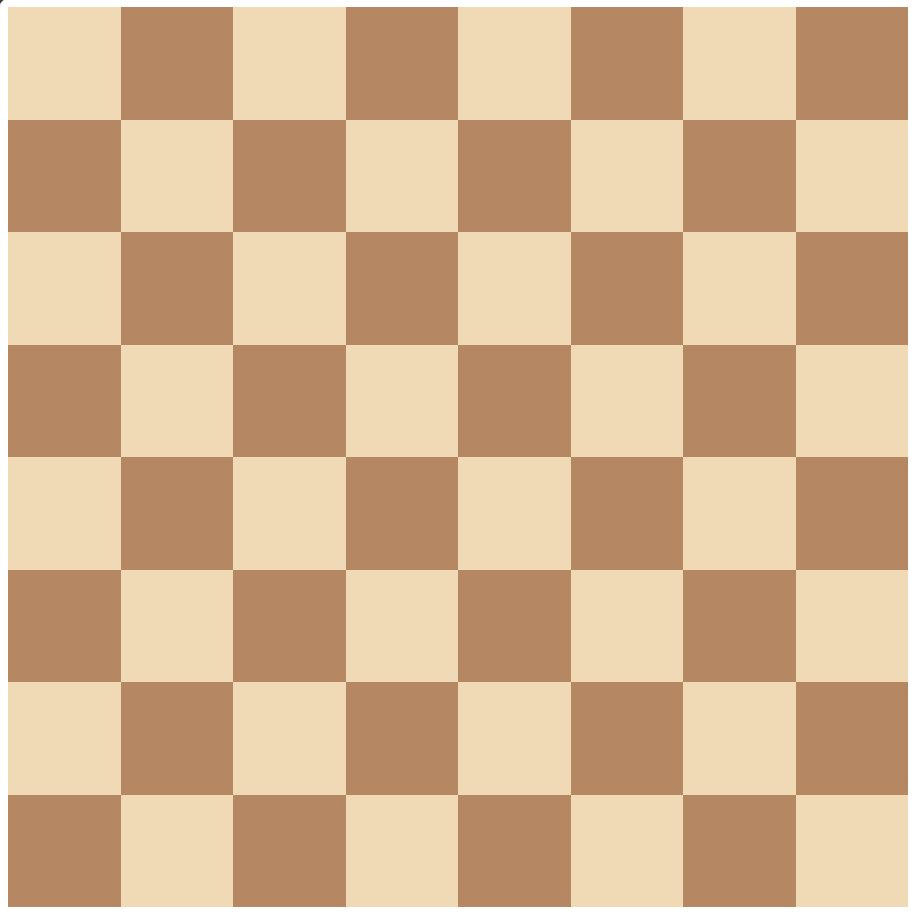
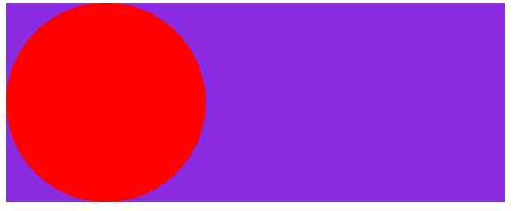
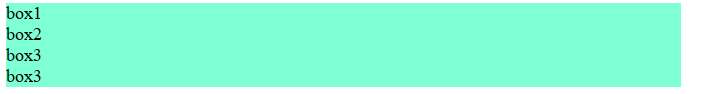
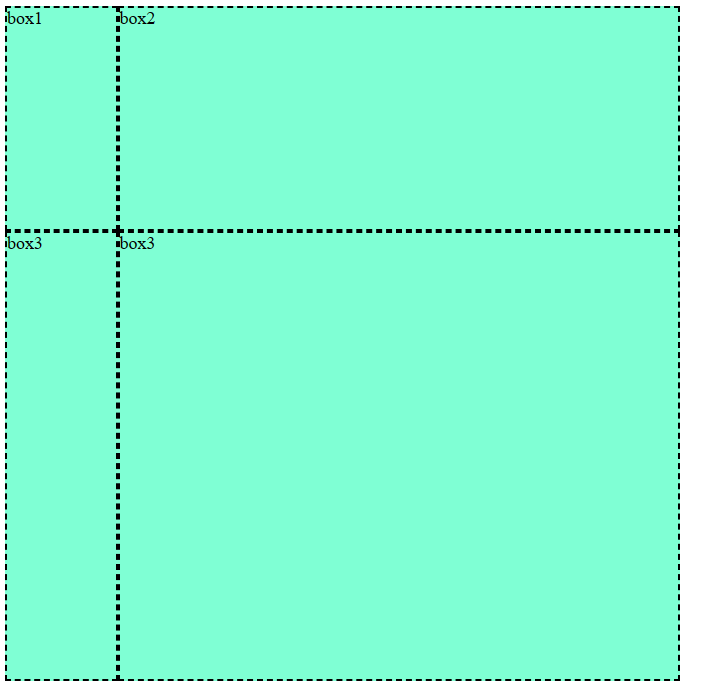
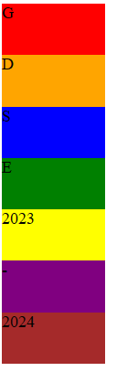
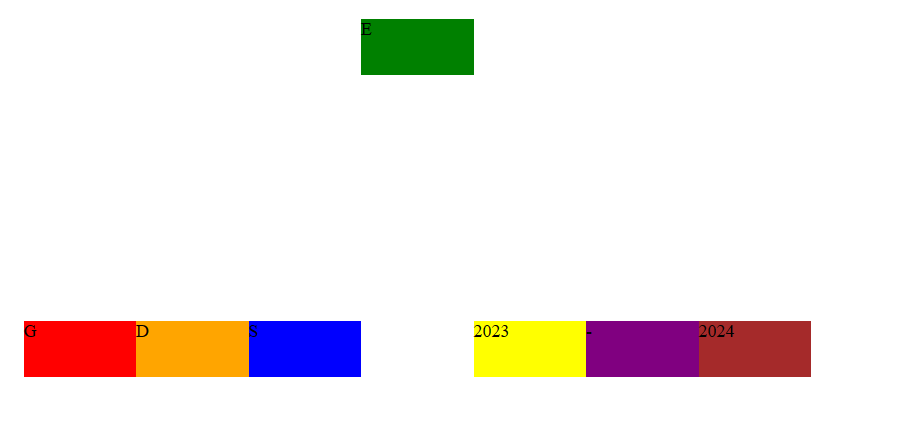
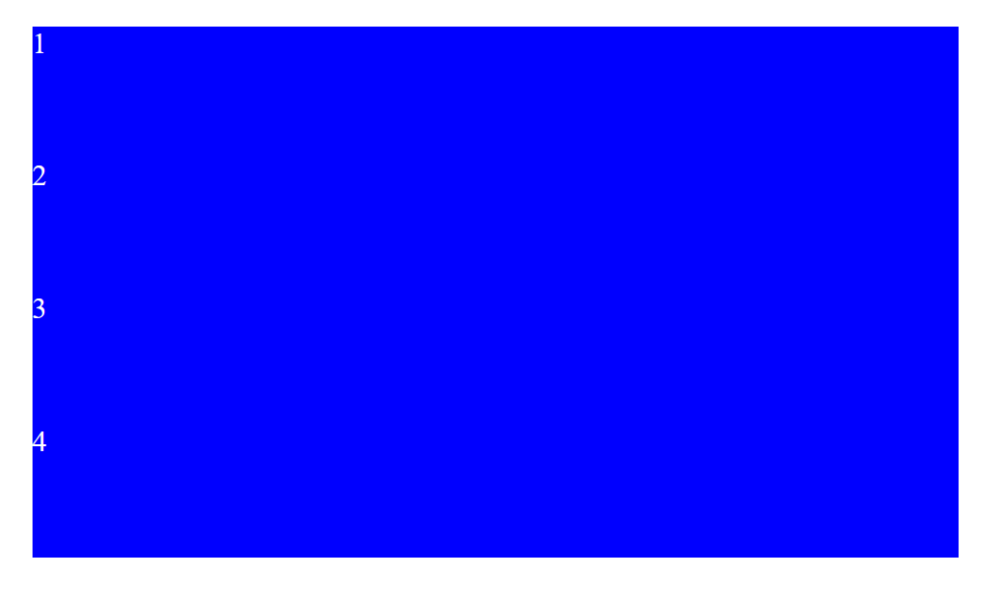
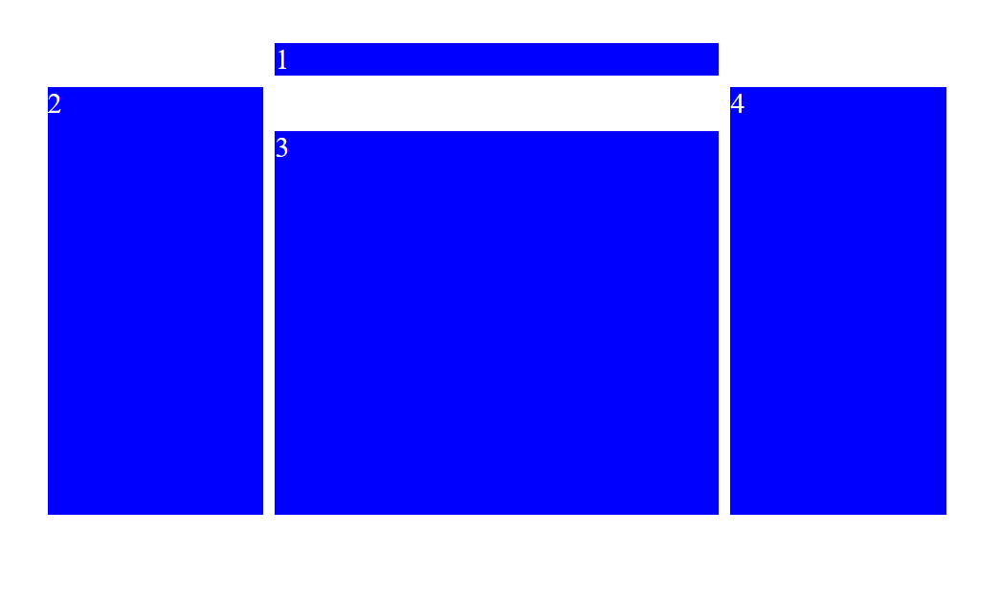

# Description about the CSS Template

There are total 6 template which you have to make using HTML and CSS. The source code of first two templates is provided.

## Template 1

###### You need to style the following element from below image

######  to below image


The source code for above thing is given below
```HTML 
<!DOCTYPE html>
<html lang="en">
<head>
    <meta charset="UTF-8">
    <meta name="viewport" content="width=device-width, initial-scale=1.0">
    <title>ques1</title>
    <style>
        .container{
            position: absolute;
        }
        .rect1{
            background-color: black;
            height: 100px;
            width: 100px;
            position: relative;
            top: 30px;
            left: 50px;
        }
        .rect2{
            background-color: rgb(125, 38, 38);
            height: 100px;
            width: 100px;
            position: relative;
            left: 100px;
            z-index: 1;
        }
        .rect3{
            background-color: rgb(213, 114, 114);
            height: 100px;
            width: 100px;
            position: relative;
            top: -30px;
            left: 150px;
        }
        .circle{
            background-color: aqua;
            height: 100px;
            width: 100px;
            border-radius: 100%;
            position: absolute;
            top: 30px;
        }
    </style>
</head>
<body>
    <div class="container">
        
        <div class="rect1"></div>
        <div class="rect2"></div>
        <div class="circle">
            <div class="rect3"></div>
        </div>
    </div>
</body>
</html> 
```

***


## Template 2

###### You need to style the following element from below image

######  to below image


The source code for above thing is given below
```HTML 
<!DOCTYPE html>
<html lang="en">
<head>
    <meta charset="UTF-8">
    <meta name="viewport" content="width=device-width, initial-scale=1.0">
    <title>ques5</title>
</head>
<style>
    .container {
      width: 800px;
      display: grid;
      grid-template-columns: 1fr 1fr 1fr 1fr 1fr 1fr 1fr 1fr;
      grid-template-rows: 1fr 1fr 1fr 1fr 1fr 1fr 1fr 1fr;
    }

    .white {
      height: 100px;
      width: 100px;
      background-color: #f0d9b5;
    }

    .black {
      height: 100px;
      width: 100px;
      background-color: #b58863;
    }
  </style>
<body>
    <div class="container">
        <div class="white"></div>
        <div class="black"></div>
        <div class="white"></div>
        <div class="black"></div>
        <div class="white"></div>
        <div class="black"></div>
        <div class="white"></div>
        <div class="black"></div>
        <div class="black"></div>
        <div class="white"></div>
        <div class="black"></div>
        <div class="white"></div>
        <div class="black"></div>
        <div class="white"></div>
        <div class="black"></div>
        <div class="white"></div>
        <div class="white"></div>
        <div class="black"></div>
        <div class="white"></div>
        <div class="black"></div>
        <div class="white"></div>
        <div class="black"></div>
        <div class="white"></div>
        <div class="black"></div>
        <div class="black"></div>
        <div class="white"></div>
        <div class="black"></div>
        <div class="white"></div>
        <div class="black"></div>
        <div class="white"></div>
        <div class="black"></div>
        <div class="white"></div>
        <div class="white"></div>
        <div class="black"></div>
        <div class="white"></div>
        <div class="black"></div>
        <div class="white"></div>
        <div class="black"></div>
        <div class="white"></div>
        <div class="black"></div>
        <div class="black"></div>
        <div class="white"></div>
        <div class="black"></div>
        <div class="white"></div>
        <div class="black"></div>
        <div class="white"></div>
        <div class="black"></div>
        <div class="white"></div>
        <div class="white"></div>
        <div class="black"></div>
        <div class="white"></div>
        <div class="black"></div>
        <div class="white"></div>
        <div class="black"></div>
        <div class="white"></div>
        <div class="black"></div>
        <div class="black"></div>
        <div class="white"></div>
        <div class="black"></div>
        <div class="white"></div>
        <div class="black"></div>
        <div class="white"></div>
        <div class="black"></div>
        <div class="white"></div>
      </div>
</body>
</html>
```

***


## Template 3

###### You need to style the following element from below image

######  to below image


***


## Template 4

###### You need to style the following element from below image

######  to below image


***


## Template 5

###### You need to style the following element from below image

######  to below image


***


## Template 6

###### You need to style the following element from below image

######  to below image
